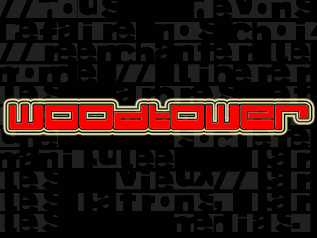
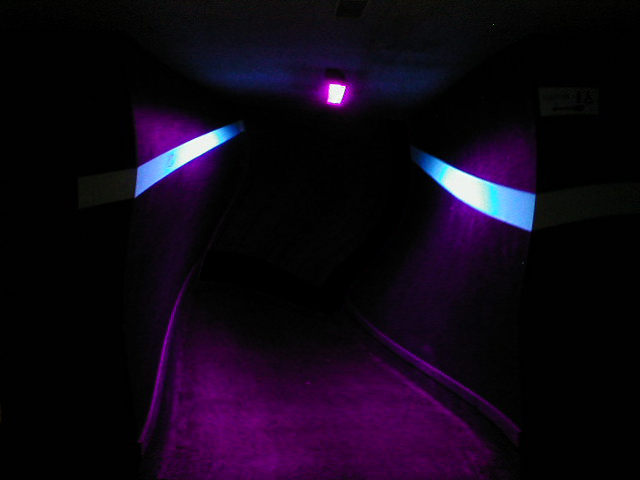
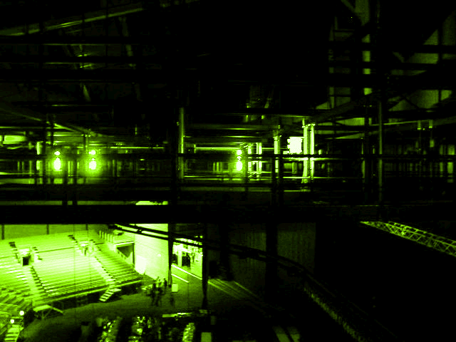
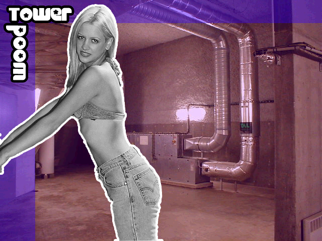
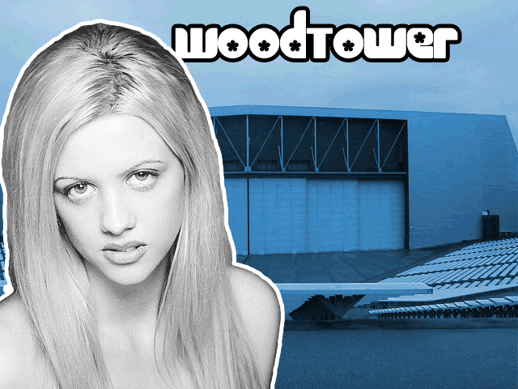
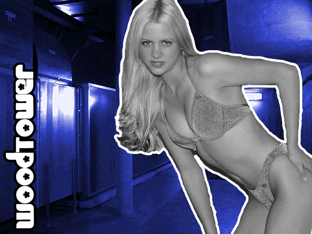

# One Night and More
Demo for Windows presented at the [Millenium demoparty](https://www.demoparty.net/milleniumparty2001/) in October 2001.

**Important**: The overview above is missing the computed visual effects going over the pictures.

**Disclaimer**: Yes, there is a young lady in there, but it was pretty common back in those days. Including that kind of pictures was considered innocuous back then. And I was in my early 20s. It's clear that a cultural shift happened over the past 20 years and what was OK in 2001 might be considered bad taste in 2020.

## What is a demo ?
A demoparty is an event that gathers demosceners and other computer enthusiasts to partake in competitions called Demoscene compos of demos (short audio-visual presentations of computer art). A typical demoparty is a non-stop event spanning a weekend, providing the visitors a lot of time to socialize. The competing works, at least those in the most important competitions, are usually shown at night, using a video projector and loudspeakers. The most important competition is usually the demo compo.

More details [on Wikipedia](https://en.wikipedia.org/wiki/Demoscene).

In a nutshell, demoparties are an ancient form of [Hackathon](https://en.wikipedia.org/wiki/Hackathon).

## Who made it ?

- **Code**: myself
- **Music**: myself
- **Graphics**: Christophe Martin

## How was it made ?
### The programming
Everything was coded over one night in [Object Pascal](https://en.wikipedia.org/wiki/Object_Pascal) using [Borland Delphi](https://en.wikipedia.org/wiki/Delphi_(software)).

I'm pretty sure I lost the source code, but I remember I used two Timer objects: one ticking every 100ms and one ticking every second.

The 3D effect is just some repurposed code found on the Internet.

### The music
Titled *Midnight Thought* (*Le Songe de Minuit* in French), it was composed by myself over a week in September 2001 using [Rave eJay for Windows 98](https://en.wikipedia.org/wiki/EJay). It's a quiet, slow paced and moody trip hop tune with an intro heavily influenced by [Miles Davis Bitches Brew](https://en.wikipedia.org/wiki/Bitches_Brew) jazz album from 1970.

I did my best to convey a sense of strangeness and magic, the kind of feeling that comes to you when you stay up late at night and have a walk in the empty streets of the city.

### The graphics
My long time friend Christophe Martin aka *Pops* took care of most of it during the demo party. It might seem silly, but it's actually common practice to keep working on your production until (and sometimes past) the deadline.

The base material was sourced part in our own pictures archive, part on the Internet. The following photos were shot around the year 2000 at [Le Zenith de Nancy](https://goo.gl/maps/g3isXqBw6fhWhQjWA) in France using one of the first Canon digital camera (bought in 1997 by Christophe's brother):

